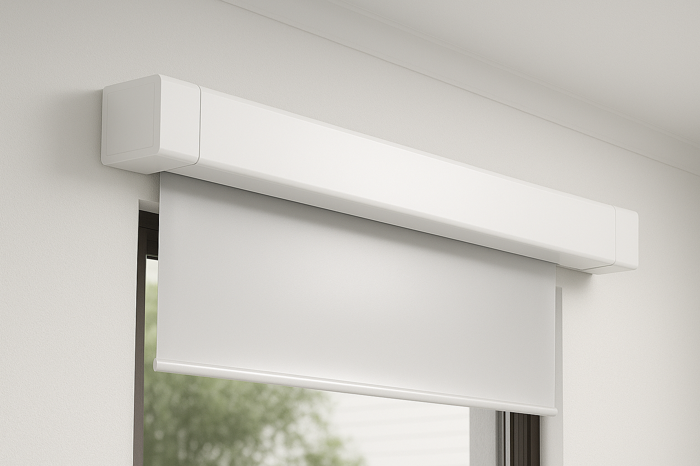
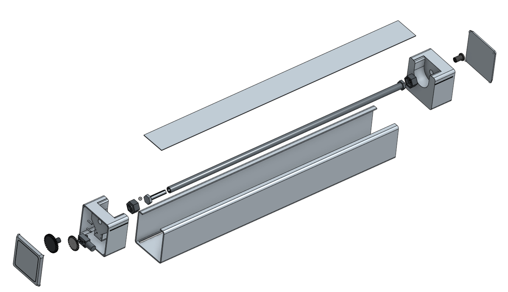
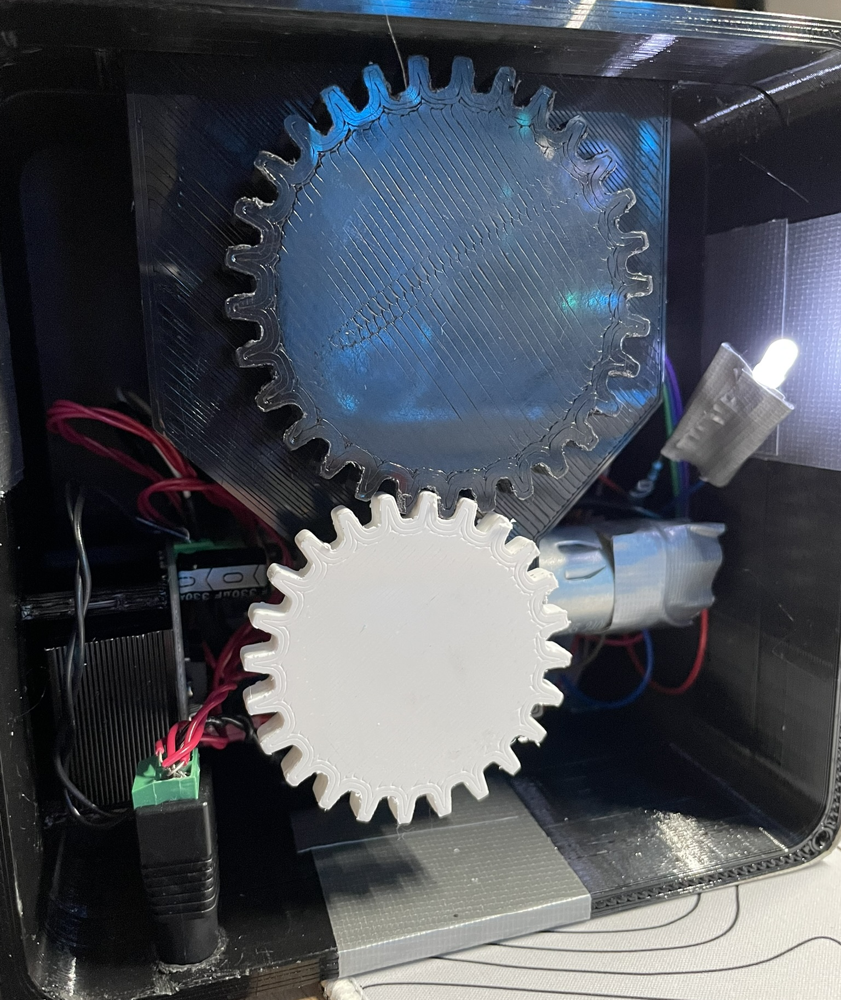

# Automated-blinds-system

First-year Mechanical Engineering design project at the University of Ottawa.  A motorized blinds system designed to automate opening and closing using a microcontroller-based control system.

# Project Overview

This project involved designing and building an automated blinds mechanism capable of controlled movement using an electric motor and electronic control system.

The goal was to create a reliable, low-cost solution that could be integrated into residential environments.

# My Contributions

Designed all mechanical components (motor mount, housing, support brackets)

Created CAD models for 3D-printed structural parts

Selected electronic components

Wired the full control system

Programmed the microcontroller to control motor actuation

Integrated and tested the full system

# Team Contributions

Fabrication and installation of blind fabric

Assistance with final assembly

General project collaboration and documentation

# Technical Details

Mechanical:

- Custom motor mount

- 3D-printed gear reduction mechanism for motor-to-rod coupling

- Structural housing design

Electrical:

- Microcontroller-based control system

- Motor driver integration

- Power supply management

Software:

- Developed motor control logic for precise actuation of the blinds

- Implemented time-of-day-based decision-making for automated opening and closing

- Integrated sensors and Bluetooth for manual smartphone control or automated operation

# What I learned

Mechanical-electrical system integration

Component selection under constraints

Rapid prototyping and iterative design

Debugging both hardware and software systems

# Future Improvements

Develop a custom smartphone app for improved manual control

Enhance enclosure aesthetics for a cleaner, more polished design

Optimize torque transmission for better motor performance
